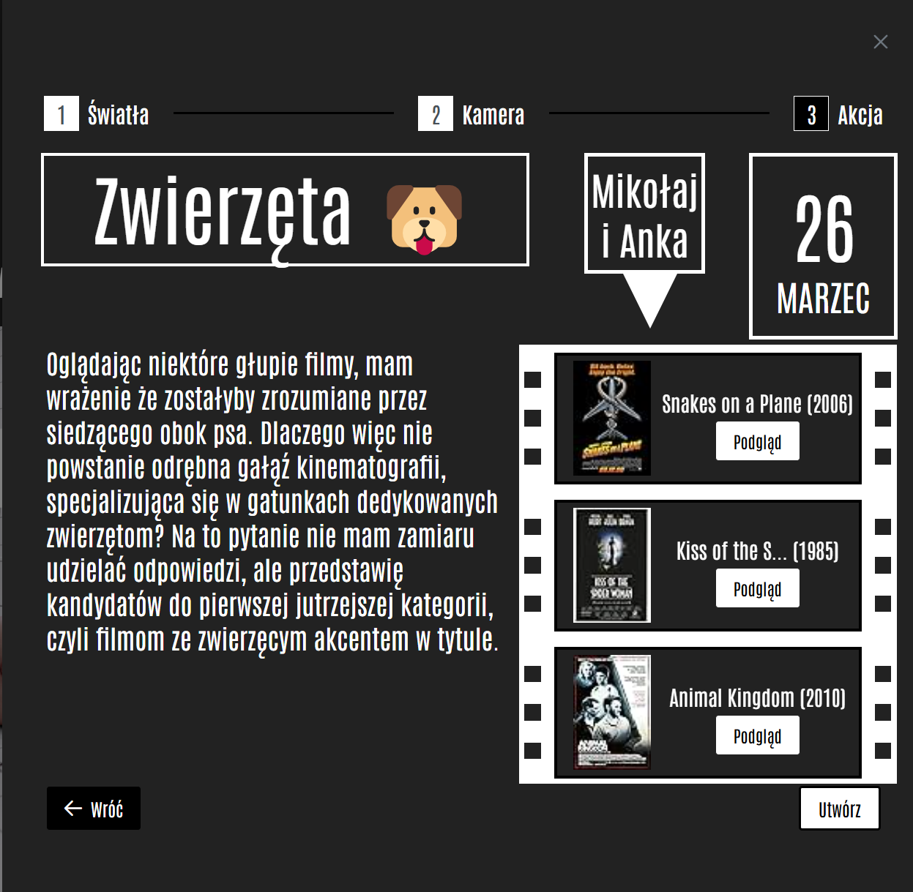
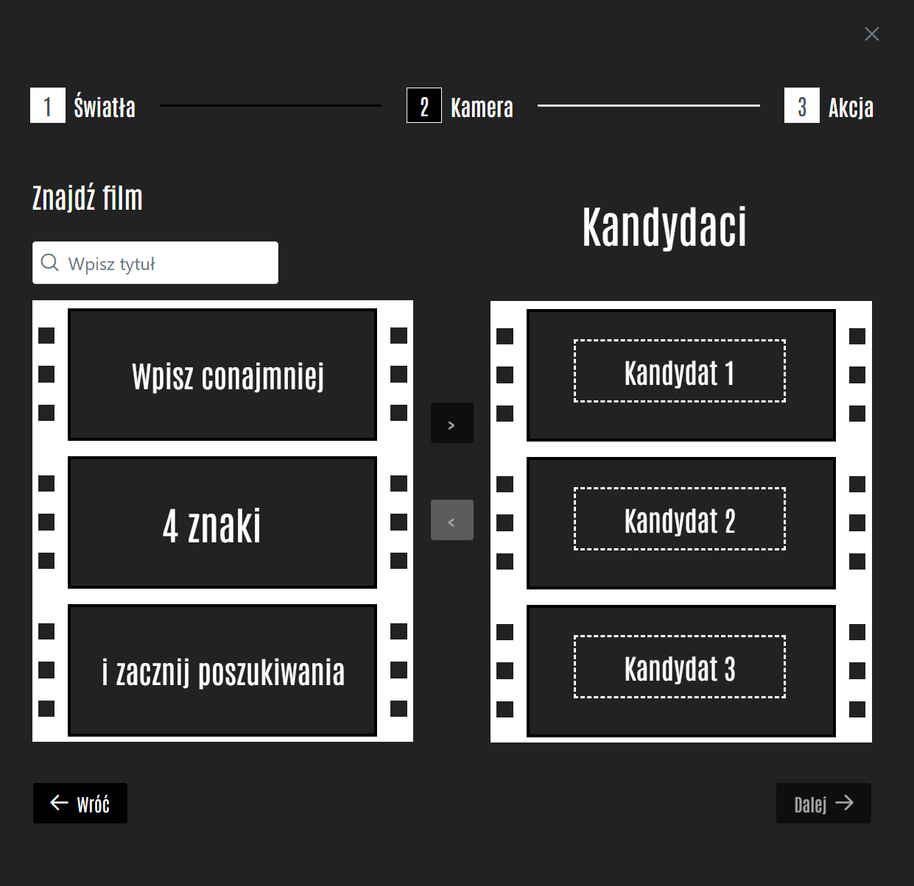
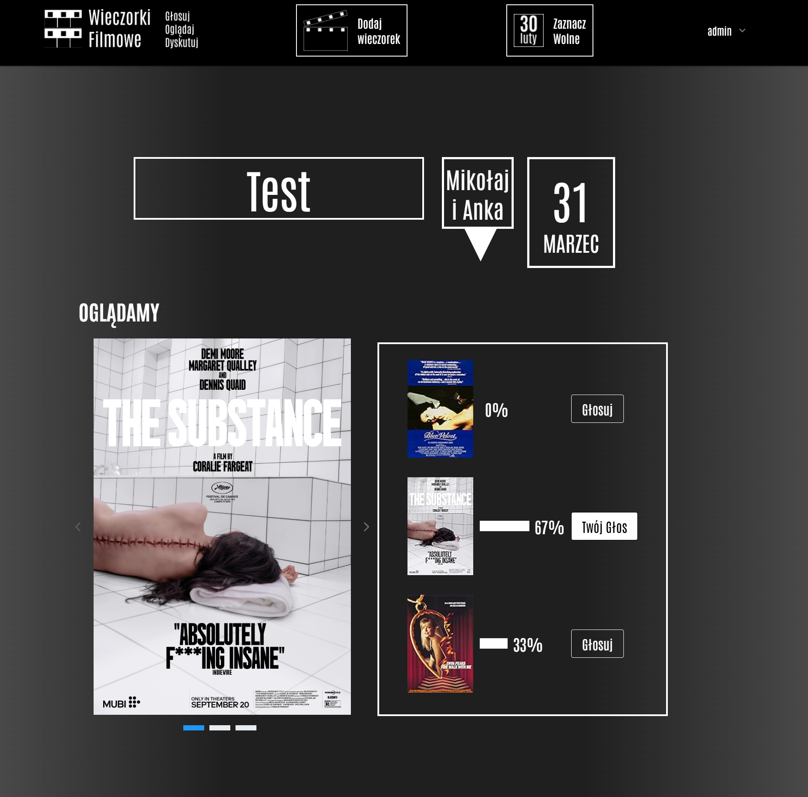

# 🎬 Movie Night – Frontend

**Movie Night** (Polish: _Wieczorek Filmowy_) is a web application designed to help groups of friends organize thematic movie nights with collaborative movie voting. This repository contains the frontend part of the application.

## 🚀 Overview

Movie Night makes it easy to organize fun and engaging movie events. Here's how it works:

1. **Create an Event** – The organizer sets up a new movie night by providing:

   - A **Title** (e.g. "Retro Sci-Fi", "Oscar Winners", etc.)
   - A **short description**
   - The **location** of the screening
   - A curated list of movie candidates pulled from the **IMDB** integration

2. **Invite Friends** – Participants can join the event and view the list of candidate films.

3. **Vote!** – Each attendee casts **one vote** for their favorite movie.

4. **Enjoy the Show** – The winning film becomes the evening’s feature presentation!

Whether you're hosting a cozy evening at home or a big-screen garden party, Movie Night helps streamline the decision-making process in a fun and social way.

## 

## 

## 

## 

## Ready to find out what we’re watching tonight? Vote now and let the Movie Night begin!

## 🧠 Tech Stack

The frontend of the Movie Night app was built with **Create React App**, based on:

- **React**

- **CSS**

- **CUSTOM COMPONENTS**

- **PRIMEREACT LIBRARY**

## 🛠️ Getting Started

Follow these steps to clone and run the project locally:

### 1. Clone the Repository

```sh
git clone https://github.com/your-username/movie-night-frontend.git

cd movie-night-frontend

```

### 2. Install Dependencies

Make sure you have Node.js installed (version 16+ recommended), then run:

```sh

npm install

```

### 3. Run Movie Night UI

```sh

npm start

```

The app should now be running at http://localhost:8000.

## 📬 Contributions

Pull requests are welcome! If you find any bugs or have feature requests, feel free to open an issue.

## 📝 License

This project is licensed under the MIT License.
